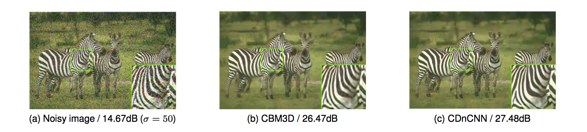

# CDnCNN-B for blind color image denoising - Tensorflow implementation

This model is trained for blind denoising at multiple noise levels (\[0, 55\]).

[DnCNN paper (TIP 2017)](http://www4.comp.polyu.edu.hk/~cslzhang/paper/DnCNN.pdf)

## Results on CBSD68 dataset



| Noise Level | CBM3D | CDnCNN-B |
|:-----------:|:-------:|:----------------:|
| 25          | 30.70   | **31.23**        |
| 50          | 27.38   | **27.97**        |

## Getting Started

This code was tested with Python 2.7. It is highly recommended to use the GPU version of Tensorflow for fast training.

### Prerequisites
```
natsort==5.4.1
numpy==1.14.5
tensorflow==1.10.0
Pillow==5.4.1
```

## Training the network

First, 128x3000 patches are extracted from the CBSD432 images as follows:

```
python2 generate_patches_rgb_blind.py
```
Then train the network:
```
python2 main_blind.py --phase train
```
You can also control other paramaters such as batch size, number of epochs. More info inside main.py.

The checkpoints are saved in ./checkpoint folder. Denoised validation images are saved after each epoch in ./sample folder.

### Tensorboard summaries
```
tensorboard --logdir=./logs
```

## Testing using the trained network

To test the network for sigma=50:
```
python2 main_blind.py --phase test --sigma 50.0
```
Denoised images are saved in ./test folder.


## Reference
1) https://github.com/Monkey-D-Groot/Machine-Learning-on-CSIC-2010 (took some ideas about parsing)

2) https://buhrmann.github.io/tfidf-analysis.html (plot function for TFidf)


